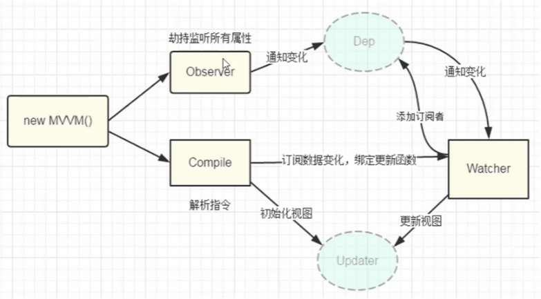

#### MVVM框架介绍
* M (Model) 模型层
* V (View) 视图层
* VM (ViewModel) 视图模型 视图模型之间的桥梁

* MVVM实现了数据双向绑定
    1. 当Model层的数据发生改变的时候，VM层会监测到数据的变化，并通知V层进行修改
    2. 修改V层会通知V层进行修改
    3. MVVM实现了视图与模型层的相互解耦

#### 主流框架的双向数据绑定的方式
* 发布-订阅者模式(backbone.js)
    一般通过pub、sub的方式实现数据和视图的绑定，但是使用起来麻烦
* 脏值检查(angular.js)
    angular.js通过脏值检测的方式对数据是否变更，来决定是否更新视图，类似于通过定时器轮训监测数据是否发生了改变
* 数据劫持
    vue.js采用数据劫持结合发布者-订阅者模式的方式。通过Object.defineProperty()劫持各个属性的setter,getter，在数据变动时发布消息给订阅者，触发相应的监听回调。
#### vue实现思路
1. 实现Compile模板解析器，可以对模板中的指令和插值表达式进行解析，并且赋予不用的操作
2. 实现一个Observe数据侦听器，可以对数据对象的所有属性进行监听
3. 实现一个Watcher观察者，将Compile的解析结果与Observe所观察对象联系起来，在Observe观察到对象数据变化时，接收通知，更新DOM
3. 创建一个公共的入口对象，接收初始化的配置并且协调上面三个模块。

#### 订阅-发布者模式（观察者模式）
* 定义了一种一对多的依赖关系，即当一个对象的状态发生改变的时候，所有依赖于他的对象都会得到通知并自动更新，解决主体对象与观察者之间功能的耦合

#### 总结
1. 通过compile解析模板的指令和插值表达式
2. 通过observe对所有的数据进行劫持
3. 通过watcher对象监听数据的改变，运用观察者模式，一旦数据发生改变，通知所有的订阅者更新dom
